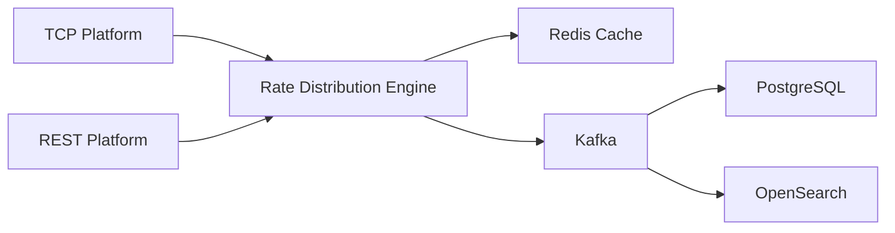

# Rate Distribution Engine - SAÜ 2025 32BIT BACKEND PROJECT

A high-performance real-time forex data processing system that aggregates, processes, and distributes foreign exchange
rates from multiple sources.

## 🚀 Features

- **Multi-Source Integration**
    - TCP-based real-time streaming
    - REST API data fetching
    - Support for multiple data providers
    - Dynamic loading of subscribers

- **Real-Time Processing**
    - BID & ASK rate aggregation
    - Dynamic rate calculations
    - 1% tolerance rule for anomaly detection
    - Real-time data validation and cleaning

- **Advanced Architecture**
    - Redis-based caching system
    - Kafka message streaming
    - PostgreSQL for persistent storage
    - OpenSearch for analytics and monitoring

- **Dynamic Calculations**
    - JavaScript and Python script support with GraalVM
    - Runtime script loading
    - Configurable calculation methods

## 🚀 Getting Started

1. **Prerequisites**
    - Java 17 or higher
    - Docker and Docker Compose

2. **Installation**
   ```bash
   git clone https://github.com/berkepite/RateDistributionEngine.git
   cd RateDistributionEngine
   ```
3. **Create env file**

    Create the .env file or rename the example file to .env and replace it with your own values.
   > If you dont want to use email service, just set it to false in the docker-compose file.

5. **Running the Application**
   ```bash
   # Start all required services (Kafka, Redis, PostgreSQL, OpenSearch)
   docker-compose up -d
   ```

## System Architecture

### Data Flow



1. **Data Ingestion**
    - TCP Platform: Real-time streaming via TCP sockets
    - REST Platform: HTTP-based rate fetching

2. **Processing Pipeline**
    - Data validation and cleaning
    - Rate calculations
    - Cache management
    - Message publishing

3. **Storage & Analytics**
    - Raw rate storage in PostgreSQL
    - Analytics and monitoring in OpenSearch
    - Real-time caching in Redis

## 🛠️ Technology Stack

| Component          | Technology            |
|--------------------|-----------------------|
| Backend            | Java (Spring Boot)    |
| Message Broker     | Apache Kafka          |
| Database           | PostgreSQL            |
| Cache              | Redis                 |
| Search & Analytics | OpenSearch            |
| Logging            | Log4j2                |
| Log Management     | Filebeat & Logstash   |
| Monitoring         | OpenSearch Dashboards |

---

## Platform Overview

The system supports two data platforms: a standalone TCP platform and a REST API platform.

* Both platforms offer data simulation with adjustable fluctuation levels: *low*, *med*, and *high*.

### REST Platform Data Format

```json
{
  "name": "USDTRY",
  "bid": 34.44,
  "ask": 35.43,
  "timestamp": "2024-12-14T21:18:21"
}
```

### TCP Platform Data Format

```
name=USDTRY|bid=34.44|ask=35.43|timestamp=2024-12-14T21:18:21
```

## Usage

### TCP Platform Environment Variables

```yaml
TCP_SERVER_USER: ${TCP_SERVER_USER}                  # Username for platform access
TCP_SERVER_PASSWORD: ${TCP_SERVER_PASSWORD}          # Password for platform access
TCP_SIMULATOR_UPDATE_INTERVAL: 2000                  # Simulator update frequency (ms)
TCP_SERVER_TOTAL_STREAMS: 1000                        # Total stream limit
TCP_SERVER_STREAM_INTERVAL: 2100                      # Stream interval (ms)
APPLICATION_PROFILE: prod                             # Application profile
SIMULATOR_ENABLED: true                              # Enable simulator
SIMULATOR_INTENSITY: med                             # Simulator intensity: low, med, high
```

Set these variables to launch the TCP platform.

---

### REST Platform Environment Variables

```yaml
REST_SERVER_USER: ${REST_SERVER_USER}                 # Username for platform access
REST_SERVER_PASSWORD: ${REST_SERVER_PASSWORD}         # Password for platform access
REST_REQUEST_LIMIT: 1000                               # Request limit
SPRING_PROFILES_ACTIVE: prod                          # Application profile
SIMULATOR_ENABLED: true                              # Enable simulator
SIMULATOR_INTENSITY: med                             # Simulator intensity: low, med, high
```

Set these variables to launch the REST platform.

---

## 🔍 Monitoring & Logging

The system provides comprehensive monitoring through:

- Real-time rate processing logs
- Subscriber event tracking
- Error tracking and alerts

## Email Service

Automatically sends alert emails to predefined groups on system errors using Gmail SMTP.
Configure with your Gmail app password and define recipient groups in a mounted file.
Enable email sending via environment variables.

## Remote Control

Control the app remotely via simple HTTP endpoints to connect/disconnect subscribers and manage their rate subscriptions
dynamically.
Use standard HTTP clients (curl, Postman) on the running app port.

Main endpoints: /api/ping, /api/subscribers, /api/subscribe, /api/unsubscribe, /api/connect, /api/disconnect.

Example:

```bash
curl -X POST "http://localhost:8080/api/subscribe?subscriber=my-subscriber" \
-u admin:1234 \
-H "Content-Type: application/json" \
-d '["USD", "EUR"]'
```

## Rate Subscription Configuration (RatesLoader)

The application allows configuring which currency rates to subscribe to externally via the RatesLoader service.

If the environment variable RDE_RATES contains a file path, the app reads currency pairs from the CSV file at that path.

If RDE_RATES contains a comma-separated list of currency pairs directly, those pairs are used.

Usage
File-based: Mount the CSV file into the container and set RDE_RATES to the file path in your docker-compose.yml.

Direct input: Set RDE_RATES directly to a comma-separated list of currency pairs.

Examples
Using a file:

```yaml
environment:
  RDE_RATES: /app/rates.csv
volumes:
  - ./rates.csv:/app/rates.csv:ro
```

rates.csv content:

```csv
USD_TRY,GBP_USD,EUR_USD
```

Using direct list:

```yaml
environment:
  RDE_RATES: USD_TRY,GBP_USD,EUR_USD
```

## Dynamic Subscriber Loading

Subscribers are dynamically loaded at runtime from JAR files, allowing modular extensions independent from the main
application.

Subscribers implement ISubscriber and ISubscriberConfig interfaces from the shared common project.

They must handle errors by throwing SubscriberException.

### Setup

1. Compile subscriber code into a JAR and place it in the subscribers folder in the main app directory.

2. Create a YAML config file for the subscriber and place it in the same folder.

3. Add subscriber binding info to application-config.yml.

4. Mount the subscribers folder in your docker-compose.yml.

5. On startup, the app loads subscribers and their configs based on the config bindings.

Example tcp-config.yaml

```yaml
name: tcp_subscriber
classPath: com.berkepite.RateDistributionEngine.TCPSubscriber
className: TCPSubscriber
url: tcp-platform
port: 8080
username: client
password: 2345
includeRates:
excludeRates:
requestInterval: 2000
requestTimeout: 10000
requestRetryLimit: 5
```

Example binding in application-config.yml

```yaml
app:
  coordinator:
    subscriber-bindings:
      - name: "TCPSubscriber"
        enabled: true
        configName: "tcp-config.yaml"
        jarName: "tcp-subscriber-0.0.1.jar"
        classPath: "com.berkepite.RateDistributionEngine.TCPSubscriber.TCPSubscriber"
        configClassPath: "com.berkepite.RateDistributionEngine.TCPSubscriber.TCPConfig"
```

## 👥 Authors

- Berke Pite
