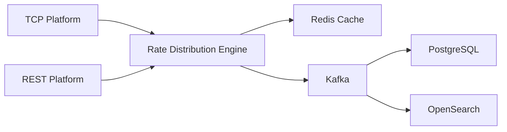

# Rate Distribution Engine - SAÜ 2025 32BIT BACKEND PROJECT

A high-performance real-time forex data processing system that aggregates, processes, and distributes foreign exchange
rates from multiple sources.

## 🚀 Features

- **Multi-Source Integration**
    - TCP-based real-time streaming
    - REST API data fetching
    - Support for multiple data providers
    - Dynamic loading of subscribers

- **Real-Time Processing**
    - BID & ASK rate aggregation
    - Dynamic rate calculations
    - 1% tolerance rule for anomaly detection
    - Real-time data validation and cleaning

- **Advanced Architecture**
    - Redis-based caching system
    - Kafka message streaming
    - PostgreSQL for persistent storage
    - OpenSearch for analytics and monitoring

- **Dynamic Calculations**
    - JavaScript and Python script support with GraalVM
    - Runtime script loading
    - Configurable calculation methods

## 🏗️ System Architecture

### Data Flow



1. **Data Ingestion**
    - TCP Platform: Real-time streaming via TCP sockets
    - REST Platform: HTTP-based rate fetching

2. **Processing Pipeline**
    - Data validation and cleaning
    - Rate calculations
    - Cache management
    - Message publishing

3. **Storage & Analytics**
    - Raw rate storage in PostgreSQL
    - Analytics and monitoring in OpenSearch
    - Real-time caching in Redis

## 🛠️ Technology Stack

| Component          | Technology            |
|--------------------|-----------------------|
| Backend            | Java (Spring Boot)    |
| Message Broker     | Apache Kafka          |
| Database           | PostgreSQL            |
| Cache              | Redis                 |
| Search & Analytics | OpenSearch            |
| Logging            | Log4j2                |
| Log Management     | Filebeat & Logstash   |
| Monitoring         | OpenSearch Dashboards |

## 📦 Data Formats

### TCP Platform Format

```
name=USDTRY|bid=34.44|ask=35.43|timestamp=2024-12-14T21:18:21
```

### REST Platform Format

```json
{
  "name": "USDTRY",
  "bid": 34.44,
  "ask": 35.43,
  "timestamp": "2024-12-14T21:18:21"
}
```

## 🔍 Monitoring & Logging

The system provides comprehensive monitoring through:

- Real-time rate processing logs
- Subscriber event tracking
- Error tracking and alerts

## 🚀 Getting Started

1. **Prerequisites**
    - Java 17 or higher
    - Docker and Docker Compose

2. **Installation**
   ```bash
   git clone [repository-url]
   cd RateDistributionEngine
   ```

3. **Running the Application**
   ```bash
   # Start all required services (Kafka, Redis, PostgreSQL, OpenSearch)
   docker-compose up -d
   ```

## 👥 Authors

- Berke Pite
